# MJ's c25k Registration App

## Concept 

This django app will be a runner registration tool for c25k groups. Currently leaders have to rely on Whatsapp group chats to know if the participants are attending each session or not and can be left waiting around for runners they think are due to attend who either haven't posted in the chat group that they aren't coming, have said they are unable to come but the leaders have missed the message, or have previously said they were coming and changed their mind but not notified the leader. Similiarly, participants who are running late but who the leader doesn't know to wait for may find that the group has already left the start point if they miss the start time. This project aims to fix that as its core aim.

## Project Scope

* It will allow run leaders to advertise the details of each weeks date, time and start location. As well as giving any additional details such as parking facilities, if trail shoes are needed, or other key information to be relayed before the start.
* It will allow site visitors to view a basic list of the planned activities, and register for a user account to gain access to further detail.
* It will allow logged in runners to see all of the details the leader has posted about the run.
* It should allow logged in runners to sign up and state that they are planning on attending a run / remove their name from the list if they change their mind. 
* It should allow leaders to view a list of runners who are planning to attend each session. 
* It should allow registered users to view and edit their details. 
* The overall site should be styled in Joggers green and yellow on completion and function with mobile first design in mind.
* It could be used to mark runners as completed to maintain a list of graduates within the database, and list graduate runs following on from the main course. 
* It could be used for runners to add an emergency contact to their account which run leaders will be able to access during sessions in case of incident during the run.  
* It could allow leaders to manage the user status of registered accounts to update the list of leaders rather than having to log into the adin panel. 
* It could enable the club to advertise details of the next course and allow runners to sign up in readiness for the start date. 

Using MoSCoW prioritisation these functions have been prioritised as 'must have', 'should have', 'could have' and have been turned into user stories to create the [project board](https://github.com/users/ccp84/projects/4/views/1?visibleFields=%5B%22Title%22%2C%22Assignees%22%2C%22Status%22%2C%22Labels%22%5D)

## Table of Contents:
1. [Wireframes](#wireframes)
2. [Data Model](#data-model)
3. [Project Development](#project-development)

## Wireframes
* Welcome Page Views


* Run Details Page Views


## Data Model


## Project Development

## REVIEW POINT 1
|At this initial review point. I have prioritised the 'must have' user stories:| 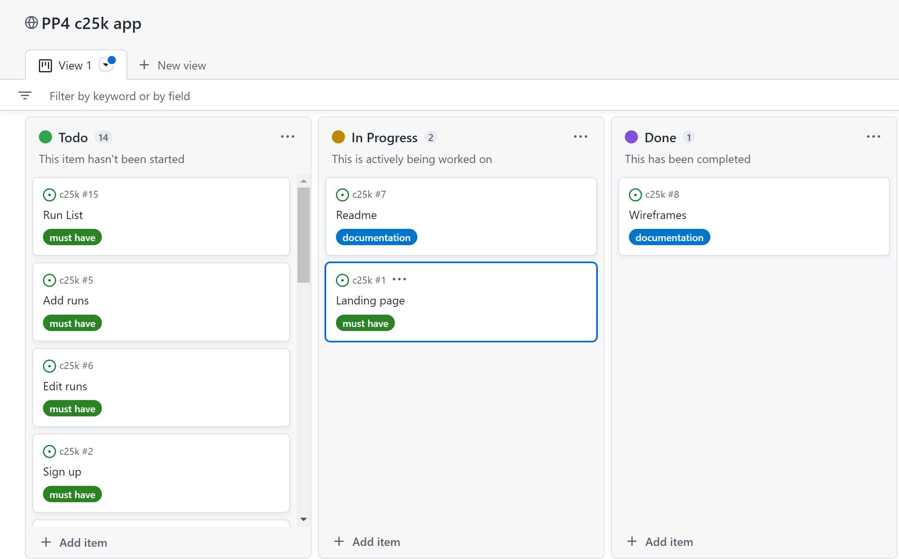 |
| ----------------------------------- | ----------------------------------------- |
| 1. Landing page | 
| 2. Display a run list |
| 3. Add, edit, delete runs|
| 4. User Authentication | 

### Run List 
This feature has been developed using the django generic CBV 'ListView':
```python
class RunList(ListView):
    model = Run
    template = 'run_list.html'
```
With a custom html template to display the correct elements to each user dependent on their authentication status:
```python

# List of current runs is displayed for the user
    
    # User has ability to edit and delete the listed run, as well as a button to add a new run

# A message is displayed inviting the user to log in, although the page is only shown in the nav bar for authenticated users
```
This page hosts the main functionality of the project allowing only authenticated users to see the full details of each run, as opposed to the basic list on the welcome page. Users tagged with the grouo of leader can also access links to edit and delete runs from the list here, as well as adding a new run from the bottom of the list. 

### Create Run
This feature is only accessible by authenticated users who have a group tag of leader. It makes use of the django generic CBV 'CreateView':
```python
class RunCreate(SuccessMessageMixin, LoginRequiredMixin, CreateView):
    model = Run
    template_name = 'run_create.html'
    fields = ["title", "leader", "location", "date", "time", "details"]
    success_url = '/run/list'
    success_message = "Run created"
``` 
and the standard form for this view, which will be styled in a later part of the project:

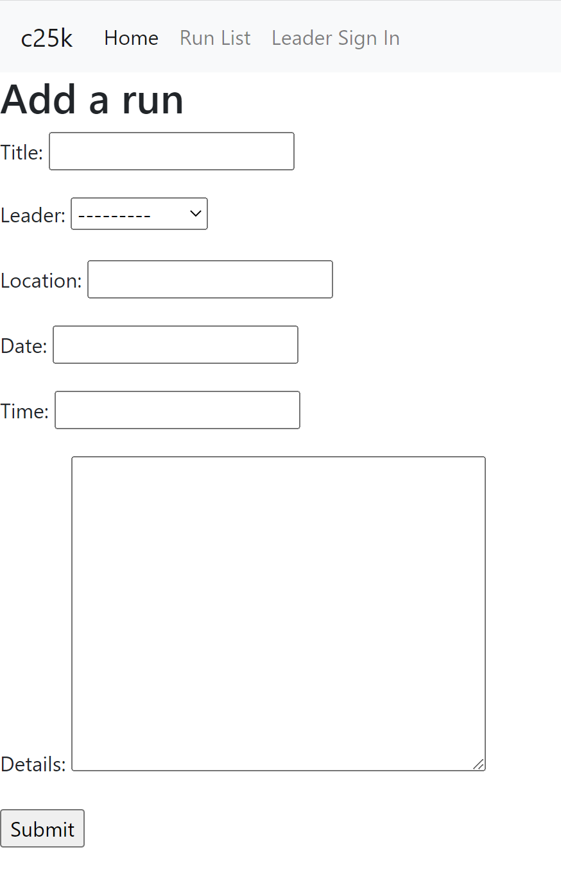

### Edit Run
This feature is very similar to the creation of a new run, and can only be accessed by authenticated users who are leaders. It uses the generic django 'UpdateView':
```python
class RunUpdate(SuccessMessageMixin, LoginRequiredMixin, UpdateView):
    model = Run
    template_name = 'run_update.html'
    fields = ["title", "leader", "location", "date", "time", "details"]
    success_url = '/run/list'
    success_message = "Run updated"
```
and again imports the standard form as well. However, the URL associated with this view expects the primary key of the run as an identifier to ensure the correct entry in the database is being updated:
```python
path("run/update/<pk>", views.RunUpdate.as_view(), name='run_update')
```
This is passed in from the html template via the anchor tag:
```html
<td><a href="">Edit</a></td>
```
The result is not only that the correct database record is updated, but also that the rendered form is pre populated for editing:

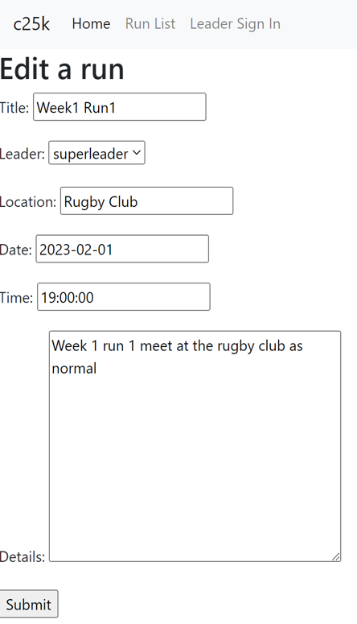

### Delete Run
Working in an almost identical way to editing, deleting makes use of the generic 'DeleteView' in views:
```python
class RunDelete(SuccessMessageMixin, LoginRequiredMixin, DeleteView):
    model = Run
    template_name = 'run_delete.html'
    success_url = '/run/list'
    success_message = "Run deleted"
```
No fields are included this time as all the template needs is an input to delete the entire record. I have updated the standard template to include a link "back to safety" in case of accidental clicking. 
The record to be deleted is identified by passing the primary key into the URL the same as when editing:
```python
path("run/delete/<pk>", views.RunDelete.as_view(), name='run_delete')
```
```html
<td><a href="">Delete</a></td>
```

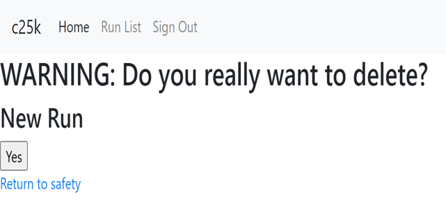

### Logging in / out

For user authentication I have used the allauth library, implementing the techniques used in the Code Institute walkthrough project. 
Once installed, and the allauth URLs imported into the project URLs.py document, log in / out is handled by the standard templates. To tidy these up and get them sitting within my main project base template I copied the allauth templates into my project and edited the `` line at the top of each of the default files. 

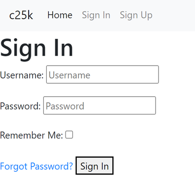

### Signup

Signing up for an account also uses allauth, however I have modified the standard allauth template so that the user is forced to complete a firstname and lastname (which are standard in the allauth library just not included in the standard signup process.)

The code added to forms.py to achieve this is :
```python
class SignupForm(forms.Form):
    first_name = forms.CharField(
        max_length=30, label='First Name', required=True)
    last_name = forms.CharField(
        max_length=30, label='Last Name', required=True)

    def signup(self, request, user):
        user.first_name = self.cleaned_data['first_name']
        user.last_name = self.cleaned_data['last_name']
        user.save()
```
For my project, a first and last name are required when signing up for runs so the leader knows who is attending. It made more sense to use the built in allauth fields than to include these in the separate Profile model. The code to implement this was found following [this thread](https://stackoverflow.com/questions/12303478/how-to-customize-user-profile-when-using-django-allauth) on stack overflow.

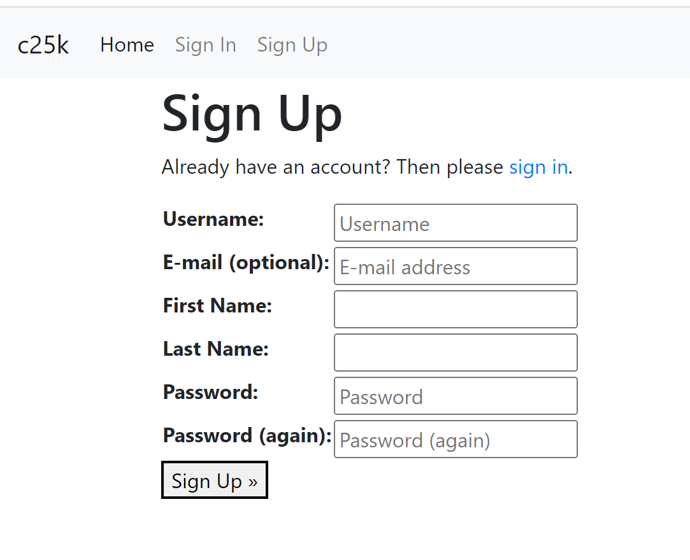

## REVIEW POINT 2
|At this point I have completed all project must have criteria and moved those user stories to completed. 
Looking at the next stage of project features, I will prioritise the should have user stories as follows:| 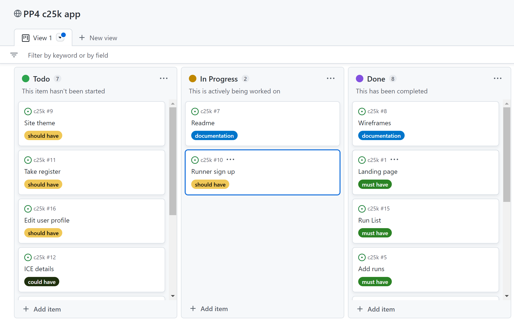 |
| -------------------------------------------- | ------------------------------------- |
| 1. Adding the ability for a user to sign up to a run |
| 2. Adding a feature for the run leader to see a register / list of signed up runners |
| 3. Allowing users to update their profile information |
| 4. Applying styling for an overall site theme |


### Displaying system messages

I have included django messages to be displayed at the top of my base template, so that the user is notified when they have successfully performed actions that trigger a system message. 
```html

    <div>
      <strong>Messages:</strong>
      <ul>
        
        <li>{{message}}</li>
        
      </ul>
    </div>

```
This sits above the content block so that they are visible no matter which page a user is on when messages are available. 

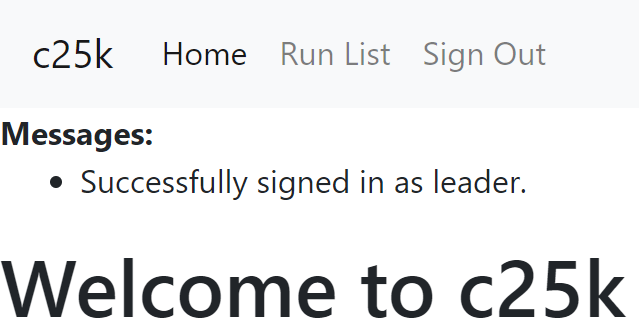

### Runner sign up
Signing up for runs is achieved in 2 parts. 

#### Step 1: The runner clicks "Count me in / out" 
This uses a new view called `run_join` which queries the `run.runners` field of the Run database filtering by `user.id`. If that user is not found within the returned queryset, then the user's id is added to the list, else if the user is already contained within the results then they are removed. The view returns to the `run_list` page once it has completed its function. 
```python
def run_join(request, pk):
    run = get_object_or_404(Run, id=pk)

    if run.runners.filter(id=request.user.id).exists():
        run.runners.remove(request.user)
    else:
        run.runners.add(request.user)

    return HttpResponseRedirect(reverse('run_list'))
```

#### Step 2: Displaying to the user if they are currently signed up or not
An additional database method was needed to achieve this. 
```python
def signed_up(self):
        name_list = []
        runner_list = self.runners.all()
        for runner in runner_list:
            name_list.append(runner.id)
        return name_list
```
A list `runner_list` is populated from running a query to retrieve all currently linked users on the many:many `run.runners` field. Then to return useable data to the django template, this list is iterated and the user id field for each object contained in the link is pushed into a blank list `name_list`. This is then returned by the method and is ready for use when called in the template.
```html

                <button type="submit" name="run_id" value="{{run.id}}">
                    <i style="color: greenyellow;" class="fas fa-running">In</i>
                </button>
                
                <button type="submit" name="run_id" value="{{run.id}}">
                    <i style="color: red;" class="fas fa-running">Out</i>
                </button>

```
The returned list is checked for the currently logged in user id. If found, a green 'already in' version of the 'Count me in' button is displayed. Othewise a red button is displayed to indicate that they have not signed up for that session. PLEASE NOTE : The in line styling will be removed when custom CSS is added to the project later, however for the purposes of getting this feature to work this is the quickest way to test functionality for now. 

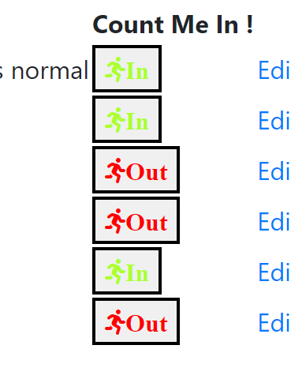

### Viewing a run register
Leaders are able to see a list of runners signed up for each run in the leader only view of the run list page. A function returns a list of names from the Run table:
```python
def take_register(self):
    register = []
    runner_list = self.runners.all()
    for runner in runner_list:
        register.append([runner.first_name, runner.last_name])
    return register
```
This function is then used to produce a list of names linked to each run:
```html
<ul>
    
        <li>{{ runner.0 }} {{ runner.1 }}</li>
    
</ul>
```
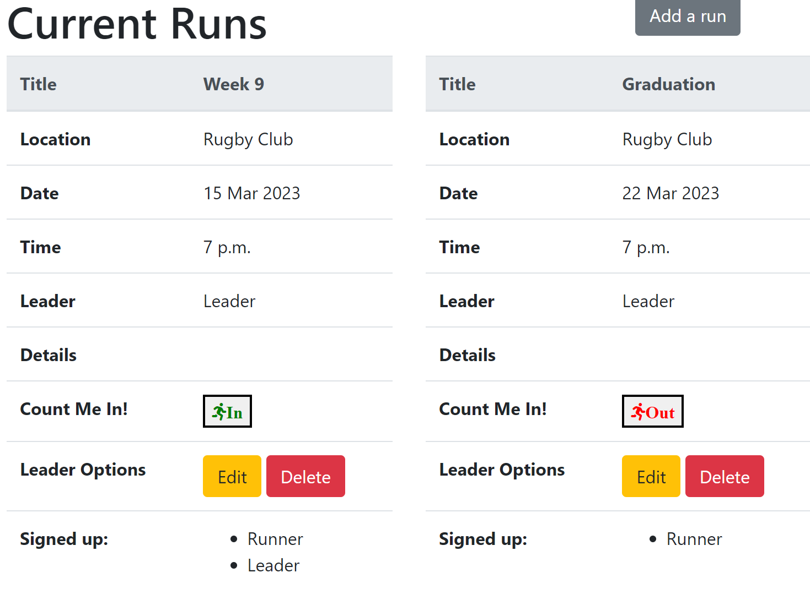

### Creating a user profile
The user profile page checks for existing details in a retrieved user profile, if the returned profile is empty then the create profile link is displayed. 
```html

<div class="row">
    <div class="col-12">
        <a href=""><button type="button" class="btn btn-secondary">Create Your
                Profile</button></a>
    </div>
</div>
```
This view uses the generic create view, and rather than displaying user as a field, adds the currently logged in user when the form is returned to create the foreign key link between Profile and User tables.
```python
class ProfileCreate(SuccessMessageMixin, LoginRequiredMixin, CreateView):
    model = Profile
    template_name = 'profile_create.html'
    fields = ['DOB', 'ICE', 'medical']
    success_url = '/profile'
    success_message = "Profile Updated"

    def form_valid(self, form):
        form.instance.user = self.request.user
        return super().form_valid(form)
```
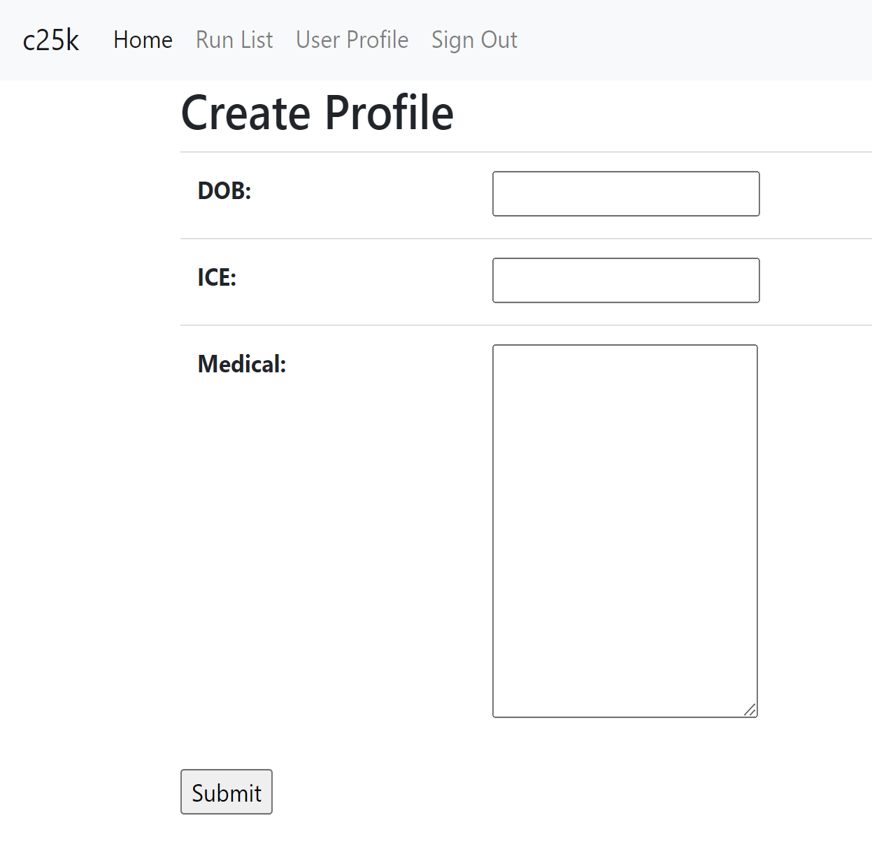

### Viewing a user profile
Once a user has created a profile, the profile page displays their user details to them. The Profile table is filtered with the currently logged in users id and the relevant instance returned as context for display. 
```python
class ProfileView(LoginRequiredMixin, View):

    def get(self, request):
        profile = Profile.objects.filter(user__id=request.user.id)

        return render(request, 'profile.html', {'profile': profile})
```
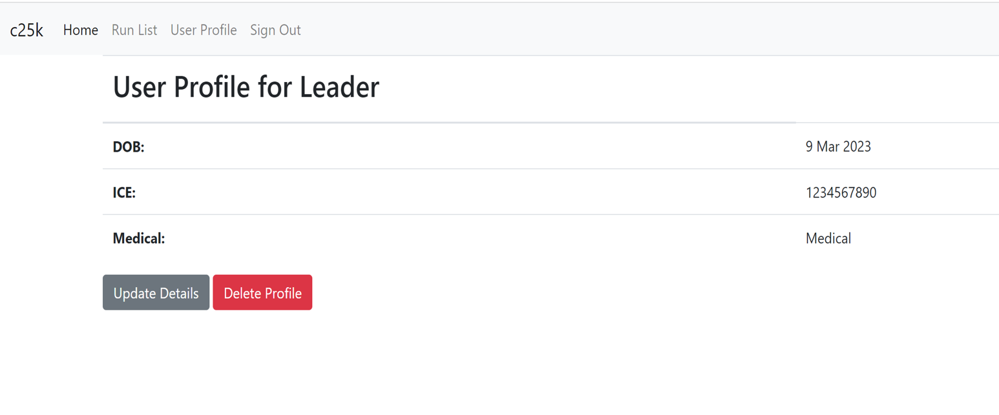

### Updating a user profile
Users have the option to update their details, updating uses the generic Update view. Instead of relying on the primary key passed through in the URL to populate the form for updating however, I have used a queryset which takes the currently logged in user id to return that users details. This means that even if you were to change the URL manually you would be unable to view another runners profile page. 
```python
class ProfileUpdate(SuccessMessageMixin, LoginRequiredMixin, UpdateView):
    model = Profile
    template_name = 'profile_update.html'
    fields = ['DOB', 'ICE', 'medical']
    success_url = '/profile'
    success_message = 'Profile Updated'

    def get_queryset(self):
        query_set = Profile.objects.filter(user=self.request.user)
        return query_set
```
As you can see here, the id is 20 when followed although this isnt what is returning the data into the form. But currently all is working:

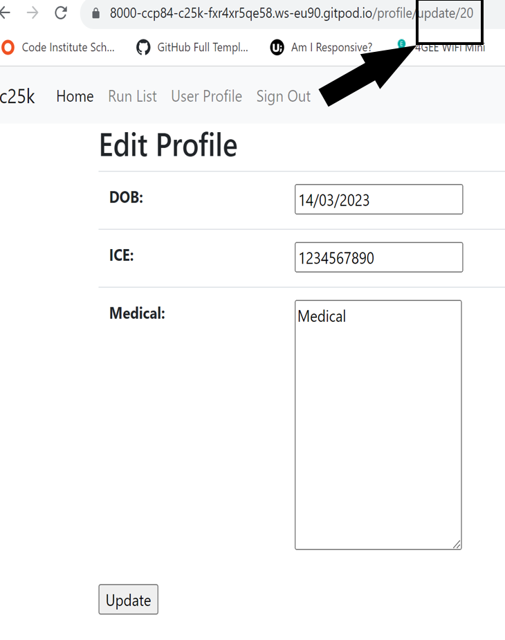

If I change the URL manually to try and access another users data, I will get an error and not be allowed to view this page:

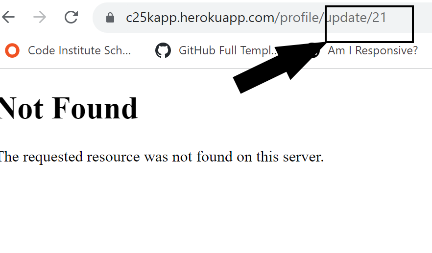

### Deleting a user profile
Users also have the option to completely delete the additional information held about them. As there is no need for a form to be populated for this, the page simply gives a warning with a button to either action the deletion or return to safety. The same checking is in place for this function with a queryset used to ensure that the user can only delete their own profile and not try to access a different user profile by manually changing the URL. 
```python
class ProfileDelete(SuccessMessageMixin, LoginRequiredMixin, DeleteView):
    model = Profile
    template_name = 'profile_delete.html'
    success_url = '/profile'
    success_message = "Profile Deleted"

    def get_queryset(self):
        query_set = Profile.objects.filter(user=self.request.user)
        return query_set
```
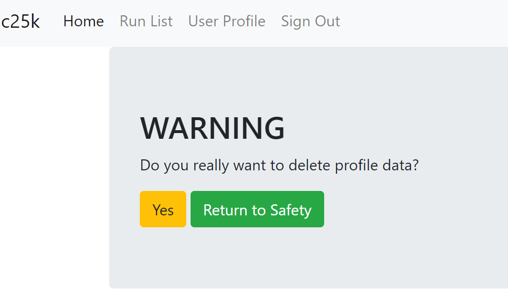

## REVIEW POINT 3
|Now that all of the critical user functionality is working, all that remains to work through are the could have points on the project board. I have prioritised these as follows. :| 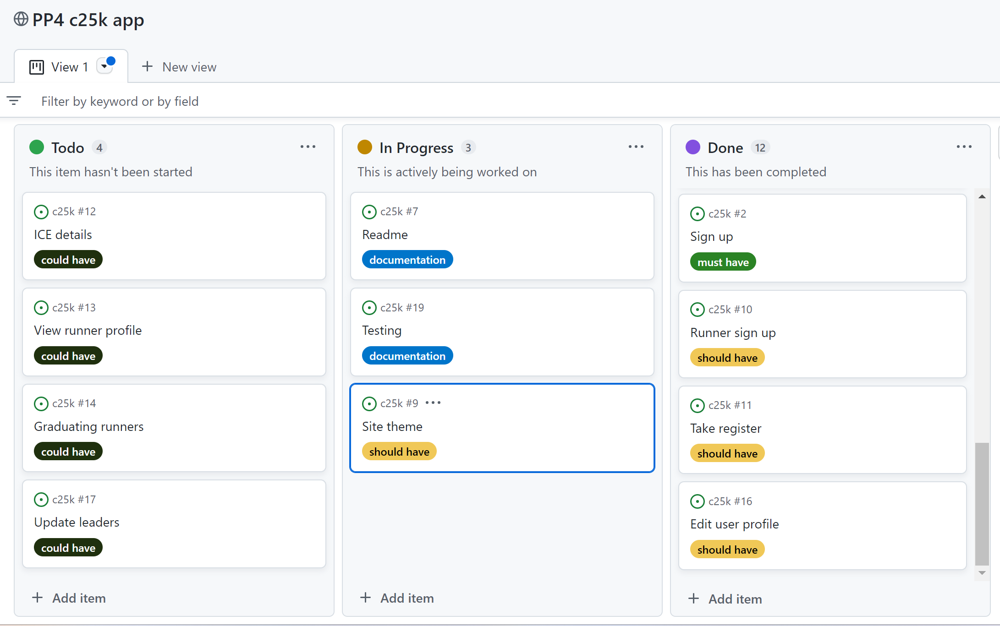 |
| -------------------------------------------- | ------------------------------------- |
| 1. Allowing users to add their ICE details to their profile |
| 2. Allowing leaders to view runners details |
| 3. Allowing leaders to update user account types from the front end |
| 4. Allowing leaders to graduate runners once they have completed the course |


## Future Features

## Testing

Link to the [TESTING.md](TESTING.md) file.

## Deployment

The live deployed application can be found deployed on [Heroku](https://c25kapp.herokuapp.com).

### ElephantSQL Database

This project uses [ElephantSQL](https://www.elephantsql.com) for the PostgreSQL Database.

To obtain your own Postgres Database, sign-up with your GitHub account, then follow these steps:
- Click **Create New Instance** to start a new database.
- Provide a name (this is commonly the name of the project: c25k).
- Select the **Tiny Turtle (Free)** plan.
- You can leave the **Tags** blank.
- Select the **Region** and **Data Center** closest to you.
- Once created, click on the new database name, where you can view the database URL and Password.

### Cloudinary API

This project uses the [Cloudinary API](https://cloudinary.com) to store media assets online, due to the fact that Heroku doesn't persist this type of data.

To obtain your own Cloudinary API key, create an account and log in.
- For *Primary interest*, you can choose *Programmable Media for image and video API*.
- Optional: *edit your assigned cloud name to something more memorable*.
- On your Cloudinary Dashboard, you can copy your **API Environment Variable**.
- Be sure to remove the `CLOUDINARY_URL=` as part of the API **value**; this is the **key**.

### Heroku Deployment

This project uses [Heroku](https://www.heroku.com), a platform as a service (PaaS) that enables developers to build, run, and operate applications entirely in the cloud.

Deployment steps are as follows, after account setup:

- Select **New** in the top-right corner of your Heroku Dashboard, and select **Create new app** from the dropdown menu.
- Your app name must be unique, and then choose a region closest to you (EU or USA), and finally, select **Create App**.
- From the new app **Settings**, click **Reveal Config Vars**, and set your environment variables.

| Key | Value |
| --- | --- |
| `CLOUDINARY_URL` | user's own value |
| `DATABASE_URL` | user's own value |
| `DISABLE_COLLECTSTATIC` | 1 (*this is temporary, and can be removed for the final deployment*) |
| `SECRET_KEY` | user's own value |

Heroku needs two additional files in order to deploy properly.
- requirements.txt
- Procfile

You can install this project's **requirements** (where applicable) using:
- `pip3 install -r requirements.txt`

If you have your own packages that have been installed, then the requirements file needs updated using:
- `pip3 freeze --local > requirements.txt`

The **Procfile** can be created with the following command:
- `echo web: gunicorn app_name.wsgi > Procfile`
- *replace **app_name** with the name of your primary Django app name; the folder where settings.py is located*

For Heroku deployment, follow these steps to connect your own GitHub repository to the newly created app:

Either:
- Select **Automatic Deployment** from the Heroku app.

Or:
- In the Terminal/CLI, connect to Heroku using this command: `heroku login -i`
- Set the remote for Heroku: `heroku git:remote -a app_name` (replace *app_name* with your app name)
- After performing the standard Git `add`, `commit`, and `push` to GitHub, you can now type:
	- `git push heroku main`

The project should now be connected and deployed to Heroku!

### Local Deployment

This project can be cloned or forked in order to make a local copy on your own system.

For either method, you will need to install any applicable packages found within the *requirements.txt* file.
- `pip3 install -r requirements.txt`.

You will need to create a new file called `env.py` at the root-level,
and include the same environment variables listed above from the Heroku deployment steps.

Sample `env.py` file:

```python
import os

os.environ.setdefault("CLOUDINARY_URL", "user's own value")
os.environ.setdefault("DATABASE_URL", "user's own value")
os.environ.setdefault("SECRET_KEY", "user's own value")

# local environment only (do not include these in production/deployment!)
os.environ.setdefault("DEBUG", "True")
```

Once the project is cloned or forked, in order to run it locally, you'll need to follow these steps:
- Start the Django app: `python3 manage.py runserver`
- Stop the app once it's loaded: `CTRL+C` or `⌘+C` (Mac)
- Make any necessary migrations: `python3 manage.py makemigrations`
- Migrate the data to the database: `python3 manage.py migrate`
- Create a superuser: `python3 manage.py createsuperuser`
- Load fixtures (if applicable): `python3 manage.py loaddata file-name.json` (repeat for each file)
- Everything should be ready now, so run the Django app again: `python3 manage.py runserver`

#### Cloning

You can clone the repository by following these steps:

1. Go to the [GitHub repository](https://github.com/ccp84/c25k) 
2. Locate the Code button above the list of files and click it 
3. Select if you prefer to clone using HTTPS, SSH, or GitHub CLI and click the copy button to copy the URL to your clipboard
4. Open Git Bash or Terminal
5. Change the current working directory to the one where you want the cloned directory
6. In your IDE Terminal, type the following command to clone my repository:
	- `git clone https://github.com/ccp84/c25k.git`
7. Press Enter to create your local clone.

Alternatively, if using Gitpod, you can click below to create your own workspace using this repository.

[](https://gitpod.io/#https://github.com/ccp84/c25k)

Please note that in order to directly open the project in Gitpod, you need to have the browser extension installed.
A tutorial on how to do that can be found [here](https://www.gitpod.io/docs/configure/user-settings/browser-extension).

#### Forking

By forking the GitHub Repository, we make a copy of the original repository on our GitHub account to view and/or make changes without affecting the original owner's repository.
You can fork this repository by using the following steps:

1. Log in to GitHub and locate the [GitHub Repository](https://github.com/ccp84/c25k)
2. At the top of the Repository (not top of page) just above the "Settings" Button on the menu, locate the "Fork" Button.
3. Once clicked, you should now have a copy of the original repository in your own GitHub account!

## Technologies Used
* Git - Version control and project flow management
* [GitHub](https://github.com/)
* [Elephant Sql](https://www.elephantsql.com/)
* [Heroku](https://www.heroku.com/home)

## Credits
* [Lucid](https://lucid.app/) - Used to create ERD
* Balsamiq - Used to create wireframes
* paint.net - Used for image manipulation
* [Codecademy django course](https://www.codecademy.com/paths/build-python-web-apps-with-django/) - This course introduced me to the use of the generic CBV's for Create, Update and Delete.
* [Code to filter by user group](https://stackoverflow.com/questions/73371568/how-to-check-user-group-in-django-template) - The code for filtering based on a users group was taken from this stack overflow article.
* [Modifications to allauth standard sign up](https://stackoverflow.com/questions/12303478/how-to-customize-user-profile-when-using-django-allauth) - The form and settings for accessing first name and last name when signing up in allauth were taken from this stack overflow article.
* [Font Awesome](https://fontawesome.com/) - Icons used throughout the project.
* [Success messages](https://docs.djangoproject.com/en/4.1/ref/contrib/messages/) - Syntax for adding success messages to views researched from the django documentation here.
* [Markdown Builder by Tim Nelson](https://traveltimn.github.io/markdown-builder) - Used for readme and testing document templates