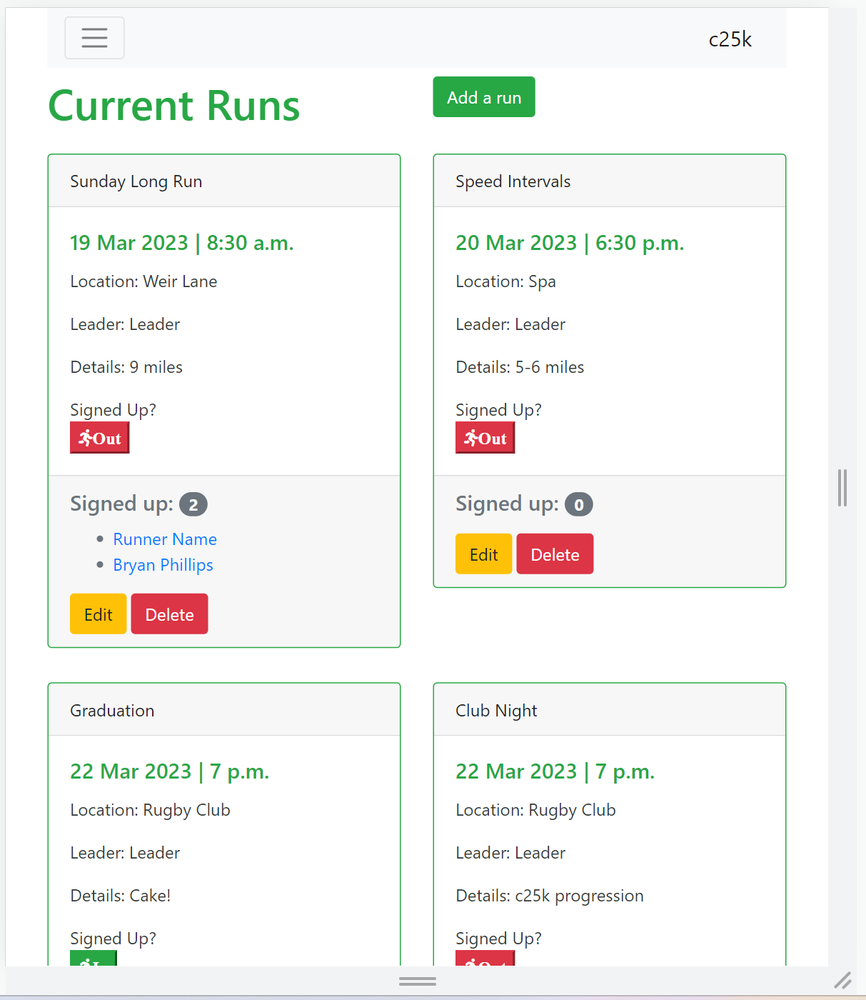
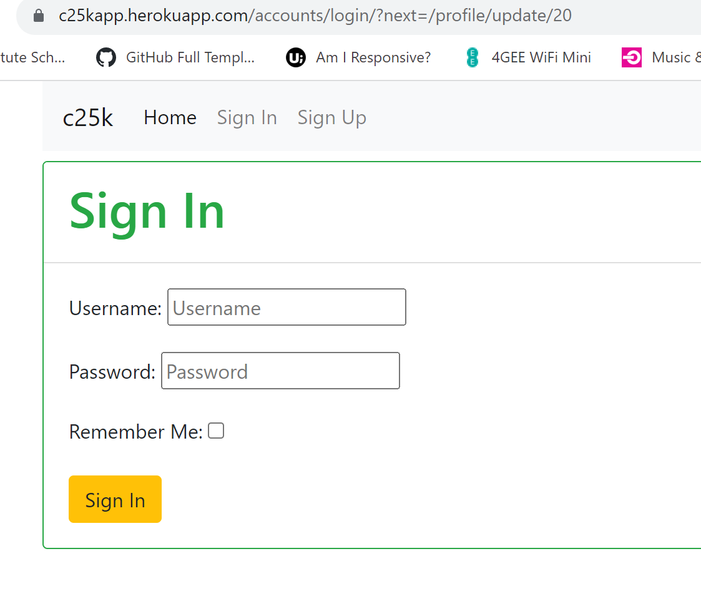
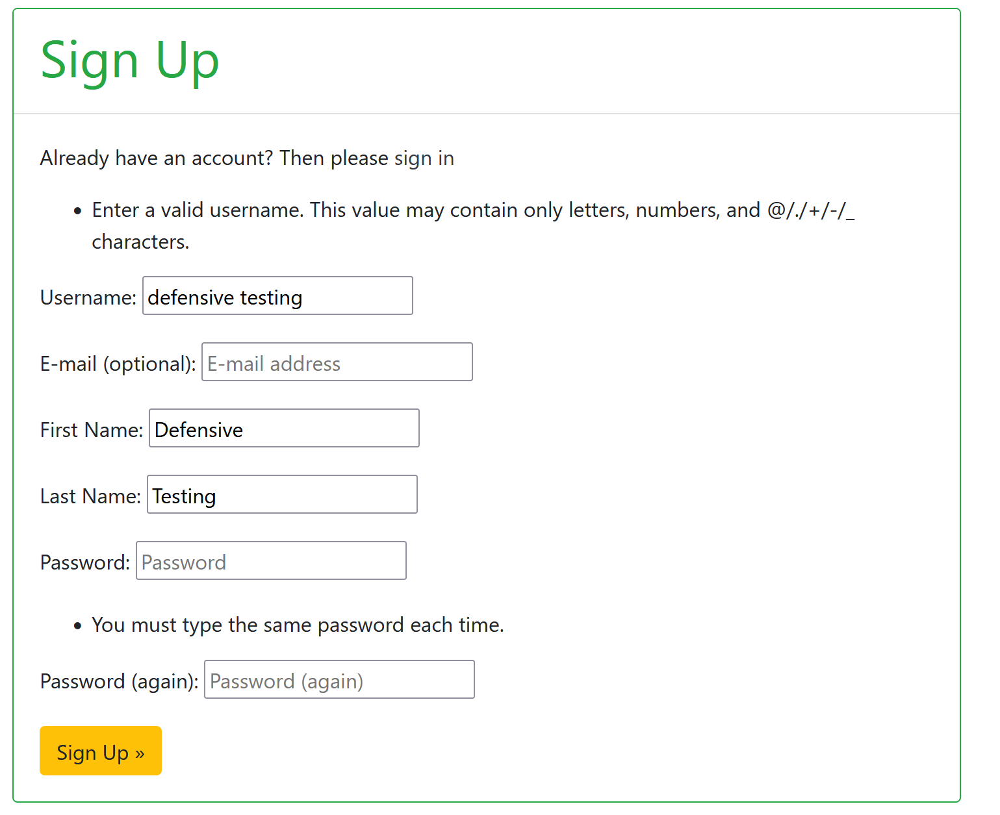
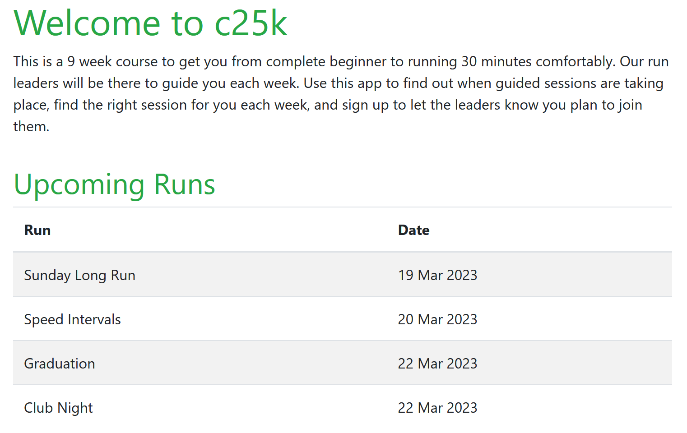

# Testing

Return to the [README.md](README.md) file.

## Code Validation

### HTML

I have used the recommended [HTML W3C Validator](https://validator.w3.org) to validate all of my HTML files.

| Page | W3C URL | Screenshot | Notes |
| --- | --- | --- | --- |
| Home | [W3C](https://validator.w3.org/nu/?doc=https%3A%2F%2Fc25kapp.herokuapp.com%2F) |  | None |
| Run list | None, authentication needed |  | None |
| Run Create | None, authentication needed |  | None |
| Run Edit | None, authentication needed |  | None |
| Run Delete | None, authentication needed |  | None |
| Profile | None, authentication needed |  | None |
| Profile Create | None, authentication needed |  | None |
| Profile Update | None, authentication needed |  | None |
| Profile Delete | None, authentication needed |  | None |
| Sign Up | [W3C](https://validator.w3.org/nu/?showsource=yes&doc=https%3A%2F%2Fc25kapp.herokuapp.com%2Faccounts%2Fsignup%2F) |  | None |
| Sign In | [W3C](https://validator.w3.org/nu/?showsource=yes&doc=https%3A%2F%2Fc25kapp.herokuapp.com%2Faccounts%2Flogin%2F) |  | None |
| Sign Out | None, authentication needed |  | None |
| Leader Tools | None, authentication needed |  | None |
| 404 | None, error page |  | None |
| 500 | None, error page |  | None |

### CSS

I have used the recommended [CSS Jigsaw Validator](https://jigsaw.w3.org/css-validator) to validate my CSS file.

| File | Jigsaw URL | Screenshot | Notes |
| --- | --- | --- | --- |
| style.css | [Jigsaw](https://jigsaw.w3.org/css-validator/validator?uri=https%3A%2F%2Fc25kapp.herokuapp.com%2F&profile=css3svg&usermedium=all&warning=1&vextwarning=&lang=en#css) |  | No errors in custom CSS, warnings shown relate to bootstrap classes |

### Python

I have used the recommended [CI Python Linter](https://pep8ci.herokuapp.com) to validate all of my Python files.

| File | CI URL | Screenshot | Notes |
| --- | --- | --- | --- |
| settings.py | [CI PEP8](https://pep8ci.herokuapp.com/https://raw.githubusercontent.com/ccp84/c25k/main/c25k/settings.py) |  | None |
| forms.py | [CI PEP8](https://pep8ci.herokuapp.com/https://raw.githubusercontent.com/ccp84/c25k/main/register/forms.py) |  | None |
| models.py | [CI PEP8](https://pep8ci.herokuapp.com/https://raw.githubusercontent.com/ccp84/c25k/main/register/models.py) |  | None |
| urls.py | [CI PEP8](https://pep8ci.herokuapp.com/https://raw.githubusercontent.com/ccp84/c25k/main/register/urls.py) |  | None |
| views.py | [CI PEP8](https://pep8ci.herokuapp.com/https://raw.githubusercontent.com/ccp84/c25k/main/register/views.py) |  | None |
| admin.py | [CI PEP8](https://pep8ci.herokuapp.com/https://raw.githubusercontent.com/ccp84/c25k/main/register/admin.py) |  | None |
| urls.py(c25k) | [CI PEP8](https://pep8ci.herokuapp.com/https://raw.githubusercontent.com/ccp84/c25k/main/c25k/urls.py) |  | None |


## Browser Compatibility

I've tested my deployed project on multiple browsers to check for compatibility issues.

| Browser | Screenshot | Notes |
| --- | --- | --- |
| Chrome |  | Works as expected |
| Firefox Developer |  | Works as expected |
| Edge |  | Works as expected |
| Safari |  | Works as expected |

## Responsiveness

I've tested my deployed project on multiple devices to check for responsiveness issues.

### Mobile (DevTools)

| View | Screenshot | Notes |
| --- | --- | --- |
| Home |  | Works as expected |
| Run List |  | Works as expected |
| Add/Edit Form |  | Works as expected |
| Delete |  | Works as expected |
| Profile |  | Works as expected |
| Leader Tools |  | Works as expected |
| Sign Up |  | Works as expected |
| Sign In |  | Works as expected |
| Sign Out |  | Works as expected |

### Tablet (DevTools)

| View | Screenshot | Notes |
| --- | --- | --- |
| Home |  | Works as expected |
| Run List |  | Works as expected |
| Add/Edit Form |  | Works as expected |
| Delete |  | Works as expected |
| Profile |  | Works as expected |
| Leader Tools |  | Works as expected |
| Sign Up |  | Works as expected |
| Sign In |  | Works as expected |
| Sign Out |  | Works as expected |

### Desktop

| View | Screenshot | Notes |
| --- | --- | --- |
| Home |  | Works as expected |
| Run List |  | Works as expected |
| Add/Edit Form |  | Works as expected |
| Delete |  | Works as expected |
| Profile |  | Works as expected |
| Leader Tools |  | Works as expected |
| Sign Up |  | Works as expected |
| Sign In |  | Works as expected |
| Sign Out |  | Works as expected |

### Other views tested

| View | Screenshot | Notes |
| --- | --- | --- |
| iPhone |  | Works as expected |
| Samsung Galaxy (Devtools) |  | Works as expected |
| iPad mini (Devtools) |  | Works as expected |
| iPad Pro (Devtools) |  | Works as expected |
| Kindle Fire (Devtools) |  | Works as expected |
| HiDPI Screen (Devtools) |  | Works as expected |
| Nokia 8110 (Devtools) |  | Interesting that it scales that far! |

## Lighthouse Audit

I've tested my deployed project using the Lighthouse Audit tool to check for any major issues.

| Page | Size | Screenshot | Notes |
| --- | --- | --- | --- |
| Home | Mobile |  | Warning for bootstrap JS link |
| Home | Desktop |  | Warning for bootstrap CDN links |
| Run List | Mobile |  | Warning for out-of-order headings and poor contrast on green button |
| Run List | Desktop |  | Warning for non-sequential headings, poor contrast on green button and bootstrap JS link |
| Add / Edit Form | Mobile |  | Warning for bootstrap CDN links,  |
| Add / Edit Form | Desktop |  | Warning for JS link |
| Delete | Mobile |  | Warning for bootstrap JS link |
| Delete | Desktop |  | Warning for bootstrap JS link |
| Profile | Mobile |  | Warning for bootstrap JS link |
| Profile | Desktop |  | Warning for bootstrap JS link |
| Leader Tools | Mobile |  | Warning for bootstrap JS link |
| Leader Tools | Desktop |  | Warning for bootstrap JS link |
| Sign Up | Mobile |  | Warning for bootstrap JS link |
| Sign Up | Desktop |  | Warning for bootstrap JS link |
| Sign In | Mobile |  | Warning for bootstrap JS link |
| Sign In | Desktop |  | repeat for any other tested pages/sizes |
| Sign Out | Mobile |  | Warning for bootstrap JS link |
| Sign Out | Desktop |  | Warning for bootstrap JS link |

## Defensive Programming

Defensive programming was manually tested with the below user acceptance testing:

| Page | User Action | Expected Result | Pass/Fail | Comments |
| --- | --- | --- | --- | --- |
| Home Page | | | | |
|1 | Click on Logo | Redirection to Home page | Pass | |
|2 | Click on Home link in navbar | Redirection to Home page | Pass | |
| Run List | | | | |
|3 | Logged out user manually loads the page | Message displayed requiring log in | Pass |  |
|4 | Click on Run List link in nav bar | Base page loads for logged-in users | Pass | |
|5 | User with leader credentials clicks on the link in nav bar | Extra register details only displayed to users with leader group credentials | Pass | |
|6 | User with leader credentials follows profile link from register | Runner profile displayed | Pass | |
|7 | User without leader credentials manually loads profile page | Message displayed requiring leader access | Pass |  |
|8 | Logged out user manually loads profile page | Error as no request will be returned from the database | Pass |  |
|9 | User with leader credentials clicks the add run button | Add run form displayed | Pass | |
|10 | User without leader credentials manually loads add run page | Message displayed requiring leader access | Pass |  |
|11 | Logged out user manually loads the add run page | Message displayed requiring log in | Pass |  |
|12 | User with leader credentials clicks the edit run button | Edit run form displayed | Pass | |
|13 | User without leader credentials manually loads edit run page | Message displayed requiring leader access | Pass |  |
|14 | Logged out user manually loads the edit run page | Message displayed requiring log in | Pass |  |
|15 | User with leader credentials clicks the delete run button | Run deletion confirmation warning displayed | Pass | |
|16 | User without leader credentials manually loads delete run page | Message displayed requiring leader access | Pass |  |
|17 | Logged out user manually loads the delete run page | Message displayed requiring log in | Pass |  |
| Profile Page | | | | |
|18 | Logged out user manually loads a profile page | Message displayed requiring log in | Pass |  |
|19 | Click on link in navbar | User specific profile loads | Pass | |
|20 | Logged-in user clicks create profile button | Create profile form loads | Pass | |
|21 | Logged out user clicks create profile button | Message displayed requiring log in | Pass |  |
|22 | Logged-in user clicks update profile button | Update profile form loads | Pass | |
|23 | Logged-in user manually changes URL of update profile form | Error due to user checking in views file | Pass |  |
|24 | Logged out user manually accesses profile update form | Message displayed to log in | Pass |   |
|25 | Logged-in user clicks delete profile button | Delete profile warning message is displayed | Pass | |
|26 | Logged-in user manually changes URL of delete profile form | Delete profile warning message is displayed | Pass |  |
|27 | Logged out user manually loads delete profile link | Message displayed to log in | Pass |  |
| Leader Tools | | | | |
|28 | User with leader credentials clicks on link | Leader tools page displayed | Pass | |
|29 | User manually loads link | Message displayed requiring leader access | Pass |  |
|30 | Logged out user manually loads link  | Message displayed to sign in | Pass |  |
| Sign-Up | | | | |
|31 |  | Sign-up form requires first and last name input | Pass |  |
|32 |  | Username meets standard requirements | Pass |  |
|33 |  | Password is entered the same twice | Pass |  |


## User Story Testing

| User Story | Screenshot |
| --- | --- |
| As a visitor, I want to be able to get information about the site so that I can decide whether to sign up or not |  |
| As a registered user I want to be able to view a list of the upcoming planned runs so that I can see where and when the next training sessions will be |  |
| As a leader, I want to be able to add a run so that runners can see when the next session is |  |
| As a leader, I want to be able to change or delete the details of a run in case of a change of plans |  |
| As a leader, I want to be able to delete runs that are no longer happening |  |
| As a registered user, I want to be able to log in to my account to access the extra features available to me as a runner or a leader |  |
| As a registered user, I want to be able to log out so that I can protect my account |  |
| As a runner/leader, I want to be able to sign up so that I can access the advanced features of the site |  |
| As a runner, I want to alert the run leader that I intend to attend an advertised run |  |
| As a leader, I want to be able to see a list of signed-up runners for a session so that I do not start without them |  |
| As a registered user, I want to be able to edit my details |  |
| As a runner, I want to be able to add an emergency contact and medical details for the run leader in case of an incident during the session |  |
| As a visitor, I want my browsing experience to be enjoyable and enhanced by overall site styling |  |
| As a leader, I want to be able to view each runner's emergency details in case of incidents during a session |  |
| As a superuser, I want to be able to change runner profiles into leader profiles without having to log into the admin panel of the site |  |
| As a leader, I want to mark runners as completed to keep a database of graduates from the course |  |

## Automated Testing

I have conducted a series of automated tests on my application.

I fully acknowledge and understand that, in a real-world scenario, an extensive set of additional tests would be more comprehensive.

### Python (Unit Testing)

I have used Django's built-in unit testing framework to test the application functionality.

In order to run the tests, I ran the following command in the terminal each time:

`python3 manage.py test register `

To create the coverage report, I would then run the following commands:

`coverage run --source=name-of-app manage.py test`

`coverage report`

To see the HTML version of the reports, and find out whether some pieces of code were missing, I ran the following commands:

`coverage html`

`python3 -m http.server`

Below are the results from the tests that I have created:

| File | Coverage | Screenshot |
| --- | --- | --- |
| views.py | 69% |  |

#### Unit Test Issues

I could not get the following test to work so I have removed this code prior to submission but would have continued from here to complete the views.py file coverage. 

```python
    def test_get_create_run_page(self):
        testuser = User.objects.create(username='test', password='test')
        self.client.login(username='test', password='test')
        response = self.client.get('/run/create')
        self.assertEqual(response.status_code, 200)
        self.assertTemplateUsed(response, 'run_create.html')
```

Error returned:
```
FAIL: test_get_create_run_page (register.tests.TestViews)
----------------------------------------------------------------------
Traceback (most recent call last):
  File "/workspace/c25k/register/tests.py", line 22, in test_get_create_run_page
    self.assertEqual(response.status_code, 200)
AssertionError: 302 != 200
```

I believe this could possibly be due to limitations based on user groups needing to be created on the test database but did not manage to find enough documentation to help me resolve this at this time. 

## Bugs

There are no remaining bugs that I am aware of.
